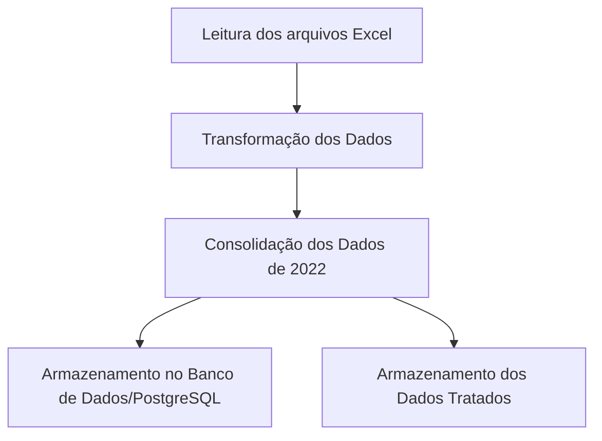

# ETL Pipeline com Apache Airflow e Python
Este projeto implementa um pipeline de ETL (Extract, Transform, Load) utilizando Apache Airflow e Python para processar dados de frutas e vegetais de diferentes anos. Os dados são extraídos de planilhas, transformados e consolidados em arquivos organizados.

## 🎯 Objetivo
O objetivo desse projeto é automatizar o processo de transformação, consolidação e carregamento de dados de frutas e vegetais a partir de vários arquivos Excel, usando um pipeline ETL orquestrado pelo Apache Airflow. O processo inclui:

1. **Extração** dos dados de arquivo Excel;
2. **Transformação** dos dados, com limpeza, formatação e enriquecimento;
3. **Carregamento** dos dados no formato desejado para análise posterior.

## ⚙️ Arquitetura
* **Pyhton** para processamento de dados;
* **Pandas** para a manipulação de dados em formato de planilhas Excel;
* **Apache Airflow** para orquestração do pipeline ETL;
* **PostgreSQL** para armazenamento dos dados transformados.

## 🗂️ Estrutura do projeto
```
📁 airflow_dags
📁 data
├── 📁 raw
    ├── 📁 fruits
    ├── 📁 vegetables
📁 datasets
├── 📁 cosolidated_files
├── 📁 processed_fruits
├── 📁 processed_vegetables
📁 scripts/
├── 📁 database/
├── 📁 exploration/
├── 📁 pipelines/
├── 📁 processing/
requirements.txt
```

## 📝 Como Usar
### Se estiver usando Linux:
1. Crie o seu ambiente virtual (virtual environment):
```
python3 -m venv nome_do_ambiente_virtual
```
2. Ative o seu ambiente virtual:
```
source nome_do_ambiente_virtual/bin/activate
```
3. Instale as dependências de requirements:
```
pip install -r requirements.txt
```
4. Crie e configure seu banco de dados PostgreSQL
5. Configure o Airflow para rodar as DAGs e sete o Airflow rodando:
```
airflow init db
```
6. Inicie o scheduler e webserver do Airflow:
```
airflow scheduler
airflow webserver -p 8080
```

## 🔄 Fluxograma



## 📥Arquivos de Entrada
Os arquivos de entrada são planilhas Excel contendo dados de frutas e vegetais. Esses arquivos devem ser colocados no diretório datasets/raw_files/ antes de executar a DAG.

## 📤Arquivos de Saída
Os dados processados e consolidados são salvos no diretório datasets/processed_files/ e datasets/consolidated_files/ como arquivos Excel.